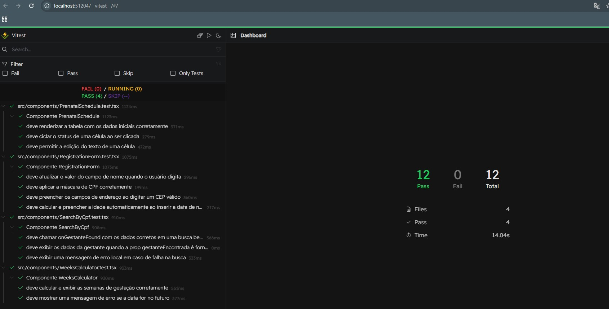

<h1 align="center">Rede Cegonha - Sistema de Acompanhamento Pré-Natal</h1>

<blockquote align="center">“Cuidar do início da vida é construir um futuro saudável e promissor.”</blockquote>

<p align="center">
  <a href="#-Funcionalidades-principais">Funcionalidades Principais</a>&nbsp;&nbsp;&nbsp;|&nbsp;&nbsp;&nbsp;
  <a href="#-stack-de-tecnologias">Stack de Tecnologias</a>&nbsp;&nbsp;&nbsp;|&nbsp;&nbsp;&nbsp;
  <a href="#-como-executar-o-projeto-localmente">Como Executar o Projeto Localmente</a>&nbsp;&nbsp;&nbsp;|&nbsp;&nbsp;&nbsp;
  <a href="#-testes-e-qualidade-de-código">Testes e Qualidade de Código</a>&nbsp;&nbsp;&nbsp;|&nbsp;&nbsp;&nbsp;
  <a href="#-desenvolvedores">Desenvolvedores</a>
</p>

<p align="center">🚧 <strong>Status:</strong> Em Desenvolvimento 🚧</p>

Sistema web para gerenciamento e acompanhamento do cronograma pré-natal de gestantes. O projeto permite o cadastro de pacientes, a busca por CPF e a gestão de um cronograma de consultas e exames de forma interativa.

## ✨ Funcionalidades Principais

- **Autenticação de Usuário:** Sistema de login e logout seguro baseado em sessão.
- **Cadastro de Gestantes:** Formulário completo para registrar novas pacientes com dados pessoais e informações de saúde.
- **Busca por CPF:** Funcionalidade para localizar rapidamente o cadastro de uma gestante existente.
- **Cronograma Pré-Natal Interativo:** Uma tabela detalhada para acompanhar todas as etapas do pré-natal.
  - Células de texto editáveis para anotações.
  - Status com códigos de cores (Pendente, Concluído, Próximo) que podem ser alterados com um clique.
  - Design Responsivo: Interface construída com Tailwind CSS para se adaptar a diferentes tamanhos de tela, de dispositivos móveis a desktops.
- **Utilitários:**
  - Calculadora de semanas de gestação.
  - Cálculo automático de idade a partir da data de nascimento.
  - Preenchimento automático de endereço a partir do CEP (via API ViaCEP).
- **Testes Automatizados:** Suíte de testes de componentes robusta para garantir a qualidade e a estabilidade do frontend.

## 🛠️ Stack de Tecnologias

O projeto é dividido em duas partes principais: um backend em Python/Flask e um frontend moderno em React.

### Frontend

- **Framework:** [React](https://react.dev/) com [TypeScript](https://www.typescriptlang.org/)
- **Build Tool:** [Vite](https://vitejs.dev/)
- **Estilização:** [Tailwind CSS](https://tailwindcss.com/)
- **Roteamento:** [React Router DOM](https://reactrouter.com/)
- **Cliente HTTP:** [Axios](https://axios-http.com/)
- **Testes:** [Vitest](https://vitest.dev/) + [React Testing Library](https://testing-library.com/)

### Backend

- **Framework:** [Flask](https://flask.palletsprojects.com/)
- **Linguagem:** Python
- **Banco de Dados:** [SQLite](https://www.sqlite.org/) com [SQLAlchemy](https://www.sqlalchemy.org/)
- **API:** RESTful JSON API
- **Autenticação:** Baseada em Sessão (Cookies)
- **CORS:** [Flask-CORS](https://www.google.com/search?q=https://flask-cors.readthedocs.io/)

## 🚀 Como Executar o Projeto Localmente

Este projeto é composto por dois repositórios separados: um para o Backend (API em Flask) e outro para o Frontend (Aplicação em React). Para rodar o projeto completo, ambos precisam estar rodando simultaneamente.

### Pré-requisitos

- [Node.js](https://nodejs.org/) (versão 18 ou superior)
- [Python](https://www.python.org/) (versão 3.8 ou superior)

---

### Rodando o Backend (Servidor)

**Repositório do Backend:** https://github.com/CamilaVerso/Backend-projeto-pi-04.git

Abra um terminal na sua pasta de projetos.

```bash
# 1. Clone o repositório do backend
git clone https://github.com/CamilaVerso/Backend-projeto-pi-04.git
cd nome-da-pasta-do-backend

# 2. Ative o ambiente virtual
# No Windows (Git Bash)
source venv/Scripts/activate
# No Mac/Linux
# source venv/bin/activate

# 3. Instale as dependências
pip install -r requirements.txt

# 4. Inicie o servidor
flask run --debug
```

O backend estará rodando em `http://localhost:5000`.

### Rodando o Frontend (Cliente)

**Repositório do Frontend:** https://github.com/CamilaVerso/Frontend-projeto-pi-04.git

Abra um novo terminal, separado do backend.

```bash
# 1. Clone o repositório do frontend
git clone https://github.com/CamilaVerso/Frontend-projeto-pi-04.git
cd nome-da-pasta-do-frontend

# 2. Instale as dependências
npm install

# 3. Inicie o servidor de desenvolvimento
npm run dev
```

A aplicação frontend estará acessível em `http://localhost:5173`.

## 🧪 Testes e Qualidade de Código

O frontend do projeto foi desenvolvido com uma alta cobertura de testes de componentes para garantir a estabilidade e a manutenibilidade do código. Os principais componentes interativos (SearchByCpf, RegistrationForm, WeeksCalculator, PrenatalSchedule) possuem testes que validam:

- Renderização inicial dos componentes.
- Interações do usuário (cliques e digitação).
- Lógicas condicionais e cálculos (ex: cálculo de idade).
- Simulação ("mock") de chamadas de API para testar os fluxos de sucesso e erro de forma isolada.

Como Rodar os Testes
Para executar a suíte de testes do frontend:

```bash
# Navegue até a pasta do frontend
cd frontend

# Roda os testes uma vez no terminal
npm test

# Roda os testes em uma interface gráfica interativa no navegador
npm run test:ui
```



## 🧑‍💻 Desenvolvedores

| Aluno                            | RA       |
| -------------------------------- | -------- |
| Adriano Alves do Nascimento      | 2230506  |
| Camila Nazare Pereira Gonçalves  | 23208252 |
| Erlandson Silva do Nascimento    | 2204739  |
| Fernando Caires Borges Goncalves | 23203515 |
| Klayton Rodrigues de Souza       | 2204509  |
| Marcia Alves Rodrigues da Silva  | 2201297  |
| Vinicius Torres Novaes           | 2214439  |
| Willians Soares de Souza         | 2229831  |

---
